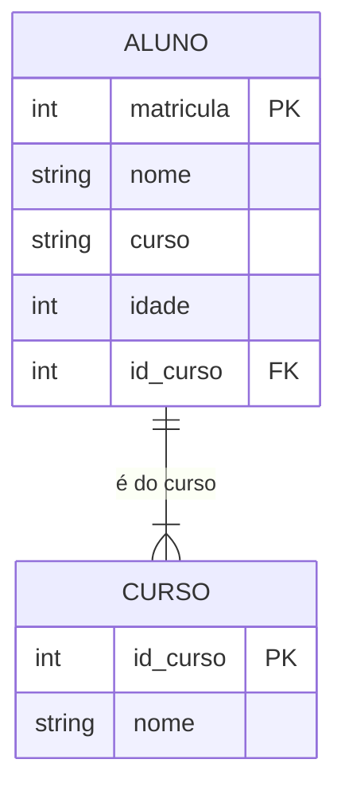

```mermaid
erDiagram
    ALUNO {
        int matricula PK
        string nome
        string curso
        int idade
        int id_curso FK
    }
    CURSO {
        int id_curso PK
        string nome
    }
    ALUNO ||--|{ CURSO : "é do curso"
```