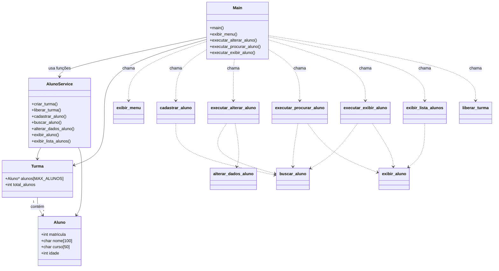

```mermaid
classDiagram

%% =========================
%% Estruturas (TAD)
%% =========================

class Aluno {
    +int matricula
    +char nome[100]
    +char curso[50]
    +int idade
}

class Turma {
    +Aluno* alunos[MAX_ALUNOS]
    +int total_alunos
}

Turma "1" --> "*" Aluno : contém

%% =========================
%% Módulo de Funções (Aluno.c)
%% =========================

class AlunoService {
    +criar_turma()
    +liberar_turma()
    +cadastrar_aluno()
    +buscar_aluno()
    +alterar_dados_aluno()
    +exibir_aluno()
    +exibir_lista_alunos()
}

AlunoService --> Turma
AlunoService --> Aluno

%% =========================
%% Módulo Principal (main)
%% =========================

class Main {
    +main()
    +exibir_menu()
    +executar_alterar_aluno()
    +executar_procurar_aluno()
    +executar_exibir_aluno()
}

Main --> AlunoService : usa funções
Main --> Turma

%% =========================
%% RELAÇÕES DE CHAMADAS
%% =========================

Main ..> exibir_menu : chama
Main ..> cadastrar_aluno : chama
Main ..> executar_alterar_aluno : chama
Main ..> executar_procurar_aluno : chama
Main ..> executar_exibir_aluno : chama
Main ..> exibir_lista_alunos : chama
Main ..> liberar_turma : chama

executar_alterar_aluno ..> buscar_aluno
executar_alterar_aluno ..> alterar_dados_aluno

executar_procurar_aluno ..> buscar_aluno
executar_procurar_aluno ..> exibir_aluno

executar_exibir_aluno ..> buscar_aluno
executar_exibir_aluno ..> exibir_aluno

cadastrar_aluno ..> buscar_aluno

exibir_lista_alunos ..> exibir_aluno
```